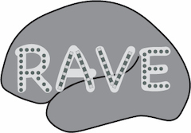

# RAVE __R__ __A__*nalysis and* __V__*isualization of intracranial* __E__*lectroencephalography*

## Install RAVE
RAVE runs on Mac, Windows or Linux. For Mac and Windows, you can download a script that will automatically install all requirements for RAVE as well as the RAVE package.
  + For Mac users, click here to download the [installation script](https://github.com/dipterix/instrave/raw/master/rave-installer-macosx.command.zip)
  
  After installation, find the file "rave-installer-macosx.command.zip" in your "Downloads" folder. If it has not automatically been unzipped, double-click to extract the file named "rave-installer-macosx.command". To run the the commands in the script, right click (if you don't have a right mouse button, hold down the control key on the keyboard and click the mouse button or trackpad) on the file to bring up an actions menu and select the first choice, "Open". You will receive a warning "rave-installer-macosx.command is from an unidentified developer. Are you sure you want to open it?". Choose "Open" to proceed. If you do not see the "Open" option (only "OK") you probably left-clicked instead of right-clicked on the installer script. Select "OK" and try again. 
  
  + for Windows users, please save the [batch file](https://raw.githubusercontent.com/dipterix/instrave/master/rave-installer-windows.bat) to your desktop. Find the file on your desktop and double-click it. 
  
   + If these scripts do not work for any reason (or for Linux users) see the [Full installation guide](./alternative_installation.md).

## Start RAVE 

* To start RAVE, type (or copy and paste) the following command into the RStudio console:
```r
rave::start_rave()
```
* A new web browser window should open showing the RAVE splash screen and the current version number (e.g. 1.0).

* For tutorials on how to use RAVE and how to load your own data into RAVE [click here](https://openwetware.org/wiki/Beauchamp:RAVE#Tutorials).


