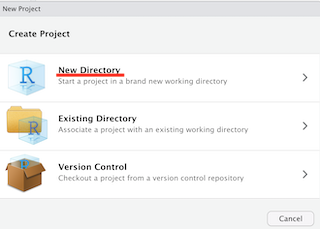
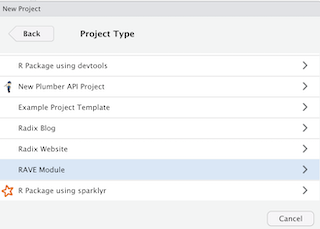
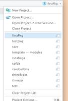
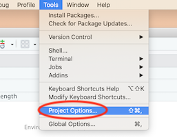
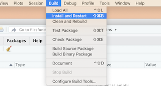
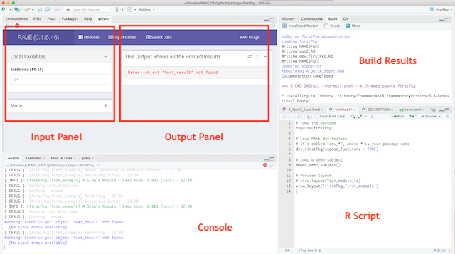
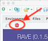

```{r setup, include = FALSE}
knitr::opts_chunk$set(
  collapse = TRUE,
  comment = "#>"
)
```


<style>
.flex-wrapper {
  display: -webkit-flex;
  display: flex;
}
.flex-wrapper-2>div{
  -webkit-flex-basis: 50%;
}
.flex-wrapper-3>div{
  -webkit-flex-basis: 33%;
}

.flex-wrapper img {
  width:100%
}
.err {
  color:red!important;
}
</style>

## Prerequisite

I assume that you have already installed 

- **R** (Suggested version `>= 3.5`)
- **RStudio** (at least version `1.2`, upgrade it [here](https://www.rstudio.com/products/rstudio/download/preview/))
- **RAVE** (at least `0.1.5.0050`, use `rave::rave_version()` to check it).

## Step 1: Create a *RAVE* Project

Open `RStudio`, on the top-left, click a small icon (), or go to `File > New Project`, 
a dialogue will pop up asking which type of project to be created. 

Choose `New Directory` to create a new project, select `RAVE Module` to create so that you have access to rave developer toolbox. 
During the final step, enter package name, path, first module ID and label. Here we create a test package called `firstPkg`, with 
a module called `A Simple Module` and its ID is `firstPkg_first_example`. Please be aware that module ID should be unique and can 
only contains letters and underscore (`_`). Please make sure it won't conflict with modules created by others. 
A good convention would be [package name]_[module name]. Be creative!

<div class="flex-wrapper flex-wrapper-3">






</div>

Once the project is created, `RStusio` will switch to project `firstPkg` automatically. You can also switch to the project manually 
in the future from top-right panel of RStudio (see the following figure).



**Make sure you switch to the correct project list before going through the rest of sections**

## Step 2: Build `firstPkg`

Open `Tools > Project Option`

<div class="flex-wrapper flex-wrapper-2">




</div>

Save all the settings, pressing `Command/Ctrl+Shift+Enter` to build the package. 
An alternative way is to use `Build > Install and Restart` in RStudio.



## Step 3: Preview Your First Module

Create a blank script, copy-paste the following code and run all.

```{r, eval=FALSE, collapse=FALSE}
# Load the package
require(firstPkg)

# Load RAVE dev toolbox
# It's called "dev_*", where * is your package name
dev_firstPkg(expose_functions = TRUE)

# Load a demo subject
mount_demo_subject()

# Preview layout
# view_layout(Your_module_id)
view_layout('firstPkg_first_example')
```

You should be able to see the following preview:




You'll see an error message:

<div class='err'>
> **Error:** object 'text_result' not found
</div>

Don't worry, we will fix this error. Follow the following steps:

1. Stop the preview by pressing "stop" button. 

2. Create an R script as follows

```{r, eval=FALSE, collapse=FALSE}
#' @title Handles results and print which electrodes selected
#' @export
text_result <- function(result){
  text_electrode = result$get_value('text_electrode')
  cat("Electrode Selected: ", text_electrode, sep = '')
}
```

3. Save the script to `firstPkg/R/results.R`
4. Enter the code in console:

```{r}
view_layout('firstPkg_first_example')
```

Now the output will directly print whatever is entered from the inputs.
