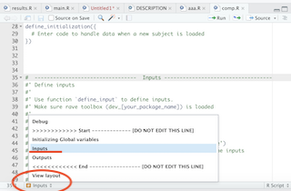
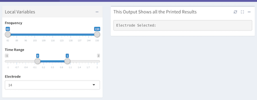
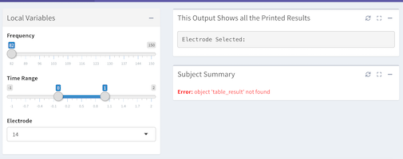
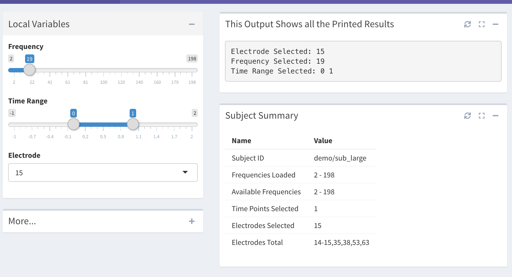

```{r setup, include = FALSE}
knitr::opts_chunk$set(
  collapse = FALSE,
  eval = FALSE,
  comment = "#>"
)
```

In this section, we will go through RAVE module structure. During the previous section, we created a package `firstPkg`. If you check the project folder in your file system, you'll find the following structure:

```
. (firstPkg, package root directory)
+-- R/
|   +-- aaa.R
|   +-- ...
|
+-- inst/
|   +-- tools/
|   |   +-- ...
|   |
|   +-- modules/
|   |   +-- firstPkg_first_example/
|   |       +-- ...
|   |   
|   +-- rave.yaml
|   
|   +-- DESCRIPTION
|   +-- NAMESPACE
|   +-- firstPkg.Rproj
|   +-- ...
```

Here are some critical files/folders

- `DESCRIPTION` contains basic descriptive information about the package;
- `NAMESPACE` controls which function to be imported from/exported to other packages;
- `R` folder contains all your functions that can be re-used by others;
- `inst` contains RAVE module and developer toolbox;
- `firstPkg.Rproj` is RStudio project file.

It's quite boring if I start by telling the usage and definition of these files. I guess most of you would probably skip this section if I do so. Therefore I decide to come up with a "real" but simple "project" that uses the real data. By implementing the "project", you'll probably begin to understand the functional designs of a RAVE module.

## A Real but Simple Module

Let's implemet a module that takes a single `electrode`, one `frequency`, one `time_range` as inputs.

The outputs will be:
1. `text_result`: prints the input values
2. `table_result`:  summarizes subject basic information in a table.

## Add UI Components

#### 1. To start, let's open `inst/modules/firstPkg_first_example/comp.R`. 

If you are using different module ID, the path will be `inst/modules/[YOUR MODULE ID]/comp.R`.

#### 2. Run the line 4-11, basically

```{r, eval=FALSE, collapse=FALSE}
require(firstPkg)
env = dev_firstPkg(T)
mount_demo_subject()
```

The first line imports your package `firstPkg`. 

The second line loads RAVE developer toolbox. It contains functions that helps you define input, output, preview module, or even fast-reload the package. 

The third line mount a demo subject for development. This step is important for developing RAVE modules offline (without launching UI).


### Define Inputs

There are three inputs:

* electrode: selective input
* frequency: numeric, single number
* time_range: numeric, interval

#### 1. Go to "Inputs" part. You can use the bottom-left button to navigate to this part, or just `cmd/ctrl+f` to search for "Inputs".



#### 2. Replace the existing code in "Inputs" part with the following code:

```{r}
define_input_single_electrode(inputId = 'electrode')
define_input_frequency(inputId = 'frequency', is_range = FALSE, initial_value = 0)
define_input_time(inputId = 'time_range', is_range = TRUE, initial_value = c(0,1))
```

These three lines define the inputs. 

* `define_input_single_electrode` is an input for one single electrode
* `define_input_frequency` defines a frequency input, `is_range=FALSE` means the input value will be a number
* `define_input_time` defines a time input, `is_range=TRUE` means the input value will be an interval

`inputId` will be the variable name of the corresponding input, for example, if user select the $14^{th}$ electrode, then you have `electrode="14"`.


If you get lost about what I'm talking about, don't worry. We will come back in the next section and introduce all kinds of inputs.

#### 3. Preview Inputs

Run code `view_layout(YOUR MODULE ID)` to preview the result:

```
view_layout('firstPkg_first_example')
```

If you are going alright, you will see the following result:




### Define Output

#### 1. Still in the same file `inst/modules/[YOUR MODULE ID]/comp.R`, go to "Outputs" part. 

You can use the bottom-left button to navigate to this part, or just `cmd/ctrl+f` to search for "Outputs".

#### 2. You will see the output `text_result` is already defined:

```{r}
define_output(
  definition = verbatimTextOutput('text_result'),
  title = 'This Output Shows all the Printed Results',
  width = 12,
  order = 1
)
```

* This part of code defines a `verbatimTextOutput`, which displays the printed results "as-is" to the output. 
* The meaning of `title` is straightforward. 
* `width` defines the output width from 1 (8.3%) to 12 (100%). It uses [Bootstrap CSS](https://getbootstrap.com/docs/4.0/layout/grid/#responsive-classes) grid system. Basically the output region is devided to 12 equally spaced columns, and `width` mean how many columns to be used by the output.
* `order` is a number indicating the order of outputs if there are multiple ones. 

#### 3. Define output `table_result`

**Append** the following code to the existing output definition:

```{r}
define_output(
  definition = tableOutput('table_result'),
  title = 'Subject Summary',
  width = 12,
  order = 2
)
```

#### 4. Preview Inputs

Run code `view_layout(YOUR MODULE ID)` again to preview the result:

```
view_layout('firstPkg_first_example')
```

If you are going alright, you will see the following result:



You might have noticed two errors. The first one is printed directly in the UI

<div class='err'>
> **Error:** object 'table_result' not found
</div>

The other one is printed in RStudio console:

>[ ERROR ]: <span class="err">[firstPkg_first_example] object 'text_electrode' not found parse_selections(text_electrode)</span>

Don't be panic seeing these errors. They appear because RAVE found your output components, but it can't find correct handlers (functions) to generate outputs. This is completely reasonable and we will fix this problem in the next part.

## Main Module Part, and output handlers

Now you have UIs for inputs and outputs, it's time to decide how to collect all the information you need and how to generate outputs.

### Collect Everything You Need for Outputs - main.R

For `table_result`, users might want to see 

* Subject ID
* Number of trials
* Range of frequencies vs. actual loaded frequencies
* Number of time points selected
* Total number of electrodes vs. actual loaded electrodes

We need to collect these data first to generate outputs.

#### 1. Open `inst/modules/firstPkg_first_example/main.R`

This file defines what kind of data to collect for the output. Let's say you have a statistical model, you probably want to fit the model here and wrap up the results so that all the outputs handlers can get access to the model results.

The first thing is to initialize the module. Run the line to enable offline debugging. It will execute code between "start" and "end" anchors in `comp.R` to initialize inputs.

```{r}
init_module('firstPkg_first_example', debug = TRUE)
#> frequency <-  0  
#> time_range <-  0 1  
#> electrode <-  14 
```

#### 2. Between `# >>>>>>>>>>>> Start` and `# <<<<<<<<<<<< End`, paste the following lines:

```{r}
# >>>>>>>>>>>> Start ------------- [DO NOT EDIT THIS LINE] ---------------------
######' @auto=TRUE

# Get subject ID
subject_id = subject$id

# Get actual loaded time
time_points = preload_info$time_points

# Get actual loaded frequencies
frequencies = preload_info$frequencies

# Get trial information
trial = module_tools$get_meta('trials')

# Get all the frequencies this subject has
all_freq = module_tools$get_meta('frequencies'); all_freq = all_freq$Frequency

# Get all valid electrodes for this subject
all_elec = subject$valid_electrodes

# Obtain user selected electrode
requested_electrode = parse_selections(electrode)

# Obtain the nearest frequency 
nearest_frequency = frequencies[which.min(abs(frequencies - frequency))]

# Obtain the time points selected
requested_time_range = time_points[time_points %within% time_range]

print(time_range)
# <<<<<<<<<<<< End ----------------- [DO NOT EDIT THIS LINE] -------------------
```

Now we have all the information needed for outputs. You might ask how to debug the code and how RAVE handle the code. 

For the first question, simply run the code above to seek for errors. 

For the second question, RAVE has already inserted a hidden function to your package called `debug_module`. You can use `firstPkg:::debug_module` to call the function (noticing there are three `:`). `:::` is usually used to extract hidden functions in packages, ** use it for debug only **.

You might want to run:

```{r}
main = firstPkg:::debug_module('firstPkg_first_example')
```

Function `debug_module` does the following things:

1. Reload package, all changes will take effect. It will stop for major syntax errors
2. Check all the dependencies and load them
3. Expose all the package functions to you for debug use
4. Check and load demo subject if no subject is loaded
5. Parse all UI components in `comp.R` and wrap up `main.R` as one function

```{r}
formals(main)
#> $frequency
#> [1] 0
#> 
#> $time_range
#> [1] 0 1
#> 
#> $electrode
#> [1] "14"
```

If you check the arguments of function `main`, you will find this function takes in arguments that are defined in `comp.R`. You can use the default values, or try different choices to change the input values.

```{r}
ret = main(time_range = c(0,2))
#> [1] 0 2

ret = main(time_range)
#> [1] 0 1
```

The return `ret` contains three elements: one `results` and two outputs. 

```{r}
names(ret)
#> [1] "results"      "table_result" "text_result" 
```

Right now, we haven't implemented output handlers, hence the two outputs will run into errors. However, we can use `results` to create handlers.

### Write Your Output Handlers (Functions)

An output handler is a function whose name is exactly the same as its outputId. Remember in the last section, we added function in `R/results.R`? That's one output handler. We need to edit this file again to add proper handlers in this case.

Open `R/results.R` first. 

#### 1. Modify the First Output `text_result`

In the previous section, we added function `text_result`

```{r}
text_result <- function(result){
  ...
}
```

Now we need to modify this function to print all the input variables "as-is" to the output UI.

First, run `result <- ret$results` in your console. 

edit function `text_result`, as follows:


```{r}
text_result <- function(result){
  cat("Electrode Selected:", result$get_value('electrode'), '\n')
  cat("Frequency Selected:", result$get_value('frequency'), '\n')
  cat("Time Range Selected:", result$get_value('time_range'), '\n')
}
```

By using `result$get_value`, you can obtain any variables declared in your main.R as well as input variables.

#### 2. Add the Output `table_result`

Add the following function to `R/results.R`:

```{r}
table_result <- function(result){
  subject_id = result$get_value('subject_id')
  
  n_trials = nrow(result$get_value('subject_id'))
  
  all_freq = result$get_value('all_freq')
  frequencies = result$get_value('frequencies')
  
  n_timepoints = length(result$get_value('time_points'))
  
  all_elec = result$get_value('all_elec')
  requested_electrode = result$get_value('requested_electrode')
  
  tbl = c(
    'Subject ID' = subject_id,
    '# of Trials' = n_trials,
    'Frequencies Loaded' = paste(range(frequencies), collapse = ' - '),
    'Available Frequencies' = paste(range(all_freq), collapse = ' - '),
    'Time Points Selected' = length(n_timepoints),
    'Electrodes Selected' = deparse_selections(requested_electrode),
    'Electrodes Total' = deparse_selections(all_elec)
  )
  
  data.frame(
    Name = names(tbl),
    Value = tbl
  )
}
```

We get variables from `result` and generate summary table.

#### Preview

```{r}
view_layout('firstPkg_first_example')
```


