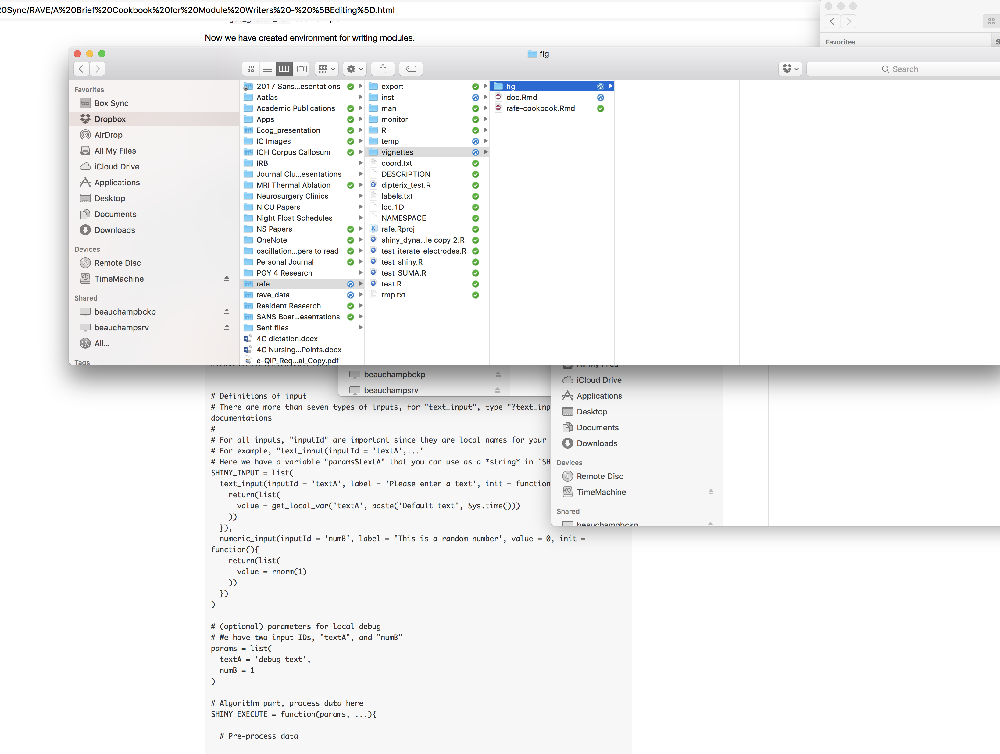

```{r setup, include=FALSE}
knitr::opts_chunk$set(echo = TRUE)
```

## Part 1

### Sub-part 1

```{r}
a <- 1
pkgname = "RAVE"
print(getwd())
```


This is doc for `r pkgname`


* list term 1
* term 2
    + sub item
  
1. ordered item 1
2. asadsda

```{r, echo=F}
plot.function(sin)
```




for additional markdown, go to [official website](http://rmarkdown.rstudio.com/authoring_basics.html)


```{}
THIS IS MATLAB

NOT RUN THOUGH
```


