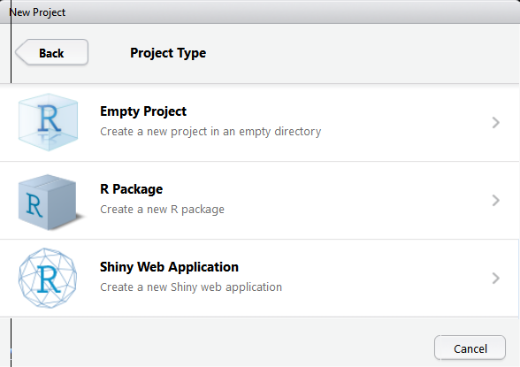
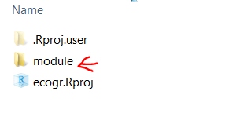
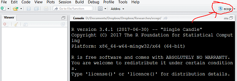
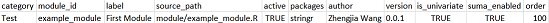

```{r setup, include=FALSE,echo=FALSE}
knitr::opts_chunk$set(echo = TRUE)
require(rave)
require(stringr)
pkgname = 'RAVE'
```

## Introduction

This is a guide book for `r pkgname` users. This "cookbook" will cover the following topics

* A brief pipeline
* Global options
* Data hierarchy
* Modules hierarchy
* Pre-process

The first part `Global options` will launch a toy application.

`Data/Modules hierarchy` will define format for data and modules. 

## A brief pipeline

Let's get `r pkgname` to work first.

#### Step 1: Create an R project environment

Download `[R](https://www.r-project.org/)`, and `[RStudio](https://www.rstudio.com/products/rstudio/download/)` and install them first.

After installation, open `RStudio > File > New Project`. Then create an empty project, save it in your local machine. In this guide book, we name it `ecogr`. (Everytime double-click `ecogr.Rproj` to open this R project)



#### Step2: install `r pkgname`

In your `RStudio`, TODO(Download from github)

Now, load `r pkgname` in your `RStudio`:

```
library(rave)
system.file('example/', package = 'rave')
```

Run the code and copy the result above and enter the path in your finder/browser, then copy `module`, `data` folder to `ecogr`. (Theoratically speaking, your `data` folder can be anywhere on the machine, but `module` folder *MUST* stays at your project folder).



#### Step3: Modify `modules.csv`

Go to `module` folder, open `modules.csv`, modefy column `source_path` to relative path (relative to project root directory). For example, your `ecogr.Rproj` folder path is `[PROJECT_ROOT_DIR]`, and `example_module.R` (inside of modules.csv) has relative path "./module/example_module.R", change `source_path` for this module to `./module/example_module.R`.

To test if this module can be found, run in `RStudio` (make sure that you are at `ecogr` project):

```
modules <- read.csv('./module/modules.csv', stringsAsFactors = F)
if(!file.exists(modules$source_path[1])){
  message('Cannot find module.')
  message('Please make sure that you can find ')
  file.path(getwd(), modules$source_path[1])
}else{
  message("Congratz! I found the module")
}
```



#### Step4: Change options

In order to let `r pkgname` know where it can find data directory as well as modules, we need to set options

```
rave_opts$set_options(
  data_dir = './data',                           # Path to data directory
  module_lookup_file = './module/modules.csv'    # Path to modules.csv
)
rave_opts$save_settings()                        # Save settings if you are 
                                                 # using MacOS/Linux
                                                 # Your settings will be loaded
                                                 # automatically next time
```

#### Step5: Setup your SUMA, Matlab, Unbuffer path

(Optional) If you want to enable SUMA, Matlab interface, you need to change some options.

#### Run app

```
init_app()
```

## Global options

Similar to system variable, or AFNI global environment, `r pkgname` also has an option `rave_opts` that controls the global variables such as data directory SUMA location, and output path etc. It's easy to change and save.

Here are the options (*all values should be characters*). You can get their values by `rave_opts$get_options("[KEY]")` and set values by `rave_opts$set_options([KEY]="[VALUE]")`

`debug`: Reserved for development. (Default '`r rave_opts$get_options('debug')`')

`data_dir`: Path to data directory containing subjects' ECoG data

`big_object_size`: [*Deprecated*] Parallel computing support if folk-clusters are disabled. (Default '`r rave_opts$get_options('big_object_size')`')

`server_time_zone`: Time zone. (Default '`r rave_opts$get_options('server_time_zone')`')

`module_export`: Path where the modules will be exported to. (Default '`r rave_opts$get_options('module_export')`')

`content_regex`: Regular expression of name for electrodes. Default value is suggested. (Default '`r rave_opts$get_options('content_regex')`')

`content_format`: Postfix for electrodes, by default is *mat*. Other formats are under development. (Default '`r rave_opts$get_options('content_format')`')

`module_lookup_file`: Index file path for modules. This file is used to manage modules. (Default '`r rave_opts$get_options('module_lookup_file')`')

`delay_input`: Measured in milliseconds. How long does `r pkgname` wait to update outputs after inputs are changed. This option prevents `r pkgname` from firing updates too frequently. Suggested value is from '20' to '200'. (Default '`r rave_opts$get_options('delay_input')`')

`max_worker`: How many active background jobs are allowed at the same time. (Default '`r rave_opts$get_options('max_worker')`')

`export_path`: Path to export modules/results. (Default '`r rave_opts$get_options('export_path')`')

`temp_dir`: Path to temporary directory. (Default '`r rave_opts$get_options('temp_dir')`')

`suma_monitor_dir`: Directory to monitor inputs from SUMA. (Default '`r rave_opts$get_options('suma_monitor_dir')`')

`suma_to_niml`: Command to generate NIML data. (Default '`r rave_opts$get_options('suma_to_niml')`')

`suma_send_niml`: [*Deprecated*] Command to send NIML generated to SUMA (*WARNING: this command is currently diabled due to some bugs in X11. Those bugs might crush SUMA*). (Default '`r rave_opts$get_options('suma_send_niml')`')

`suma_nodes_per_electrodes`: How many nodes in `electrodes_*.gii` stands for one electrode. (Default '`r rave_opts$get_options('suma_nodes_per_electrodes')`')

`suma_parallel_cores`: For parallel computing, how many CPU cores will be used to calculate SUMA values. (Default '`r rave_opts$get_options('suma_parallel_cores')`')

`suma_gifti_name_regex`: Regular expression to find GIFTY files that store electrodes. (Default '`r rave_opts$get_options('suma_gifti_name_regex')`')

`dyld_library_path`: Google *"AFNI dyld_library_path"*". (Default '`r rave_opts$get_options('dyld_library_path')`')

`suma_path`: Where to find `suma` command. (Default '`r rave_opts$get_options('suma_path')`')

`suma_spec_file`: Name for spec file in subjects' folder. (Default '`r rave_opts$get_options('suma_spec_file')`')

`unbuffer_path`: Where to find `unbuffer` command (On `MacOS`, please install `expect` package. Default '`r rave_opts$get_options('unbuffer_path')`')

`matlab_path`: Where to find Matlab. (Default '`r rave_opts$get_options('matlab_path')`')

`use_rhdf5`: This feature is still under development. (Default '`r rave_opts$get_options('use_rhdf5')`')

`batch_bytes`: This number controls memory usage, only valid if `use_rhdf5=FALSE`. Set this option as large as possible. However, it should not exceed half of the RAM. For example, you are running `r pkgname` on a 64GB-RAM machine, this value is suggested to be `32000000000`. (*32000000000 Bytes = 32GB*). (Default '`r rave_opts$get_options('batch_bytes')`')


## Data Hierarchy

Let's check the toy example at `data` folder

```
[ DATA_DIRECTORY ] `./data`
+-- SUBJECT_ID_01 (dipterix)
|   +-- ecog
|   |   +-- cached (Optional, automatically generated)
|   |   +-- meta
|   |   |   +-- electrodes.csv
|   |   |   +-- frequencies.csv
|   |   |   +-- time_points.csv
|   |   |   +-- trials.csv
|   |   +-- e1.mat
|   |   +-- e2.mat
|   |   +-- e3.mat
|   |   +-- ...
|   +-- suma
|   |   +-- rave (Optional, automatically generated)
|   |   |   +-- *.csv
|   |   |   +-- *.niml.dset
|   |   +-- electrodes.gii
|   |   +-- lh.pial.gii
|   |   +-- rh.pial.gii
|   |   +-- test.spec
+-- SUBJECT_ID_02
...
```

In our example, there is only one subject with ID `dipterix`. In `r pkgname`, this folder name will be the IDs for subjects. Within each subject folder, there are two sub-folders `ecog` and `suma`. 

`ecog` contains ECoG signals, with `ei.mat` for each electrode `i`. Within each `.mat` file, data should be a three-mode tensor (trials x frequencies x time). `meta` folder contains experiment meta information, whose format will be defined in part *Pre-process*. Notice that you don't have to create `cached` folder because once data is prepared, this folder will be generated by function `cache_subject`

`suma` folder contains three GIFTY files and one `test.spec`. `r pkgname` will launch SUMA via command `suma -spec test.spec`. In the setting-up phase, there's no need to create `rave` folder. It will be automatically created in the future.


## Modules hierarchy

Let's check the toy example at `module` folder. You can see that this folder is quite simple compared to data directory. There is one `modules.csv` file, as well as several R scripts. Each R scripts is a module. `modules.csv` is an index file that manages modules.



It is highly recommended that you **copy module directory in your project folder, and use relative path (relative to project folder) inside of modules.csv.**

`category`: Reserved for future use

`module_id`: unique ID for each modules

`label`: Module's name

`source_path`: Relative path to `ecogr` project, where to find module script.

`active`: Default `TRUE`. `FALSE` if the module is de-activated

`packages`: Additional packages needed to run the module. Use "," to seperate packages. For example `stringr,MASS`. Those packages will be downloaded automatically if not installed. However, it's highly suggested that you install them manually since this feature is still under test.

`author`: Who wrote the module

`version`: Reserved

`is_univariate`: Reserved

`suma_enabled`: Reserved

`order`: Order of modules

## Pre-process

Let's feed the real ECoG data to `r pkgname`

TODO (Need patrick's doc)
